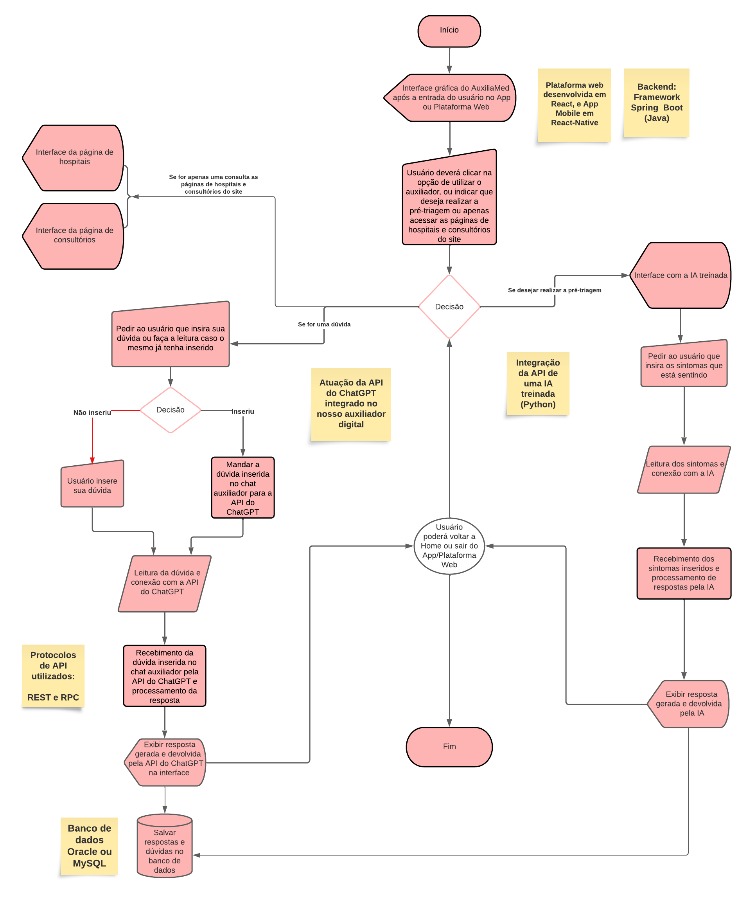
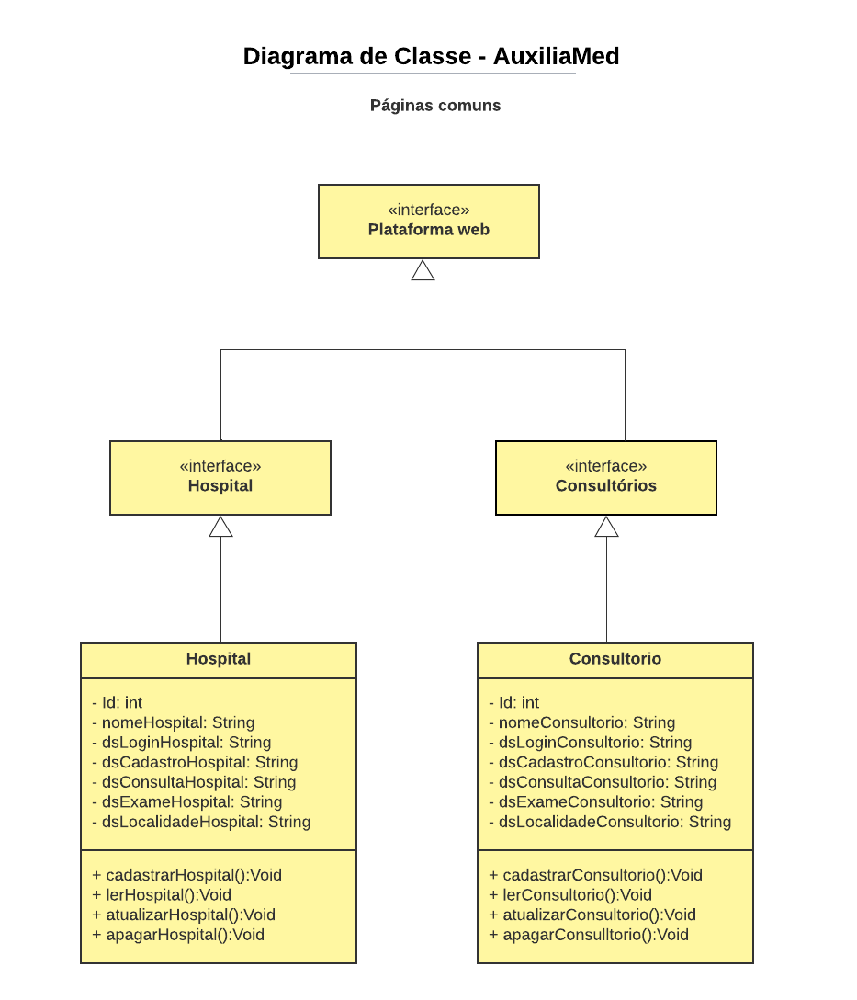
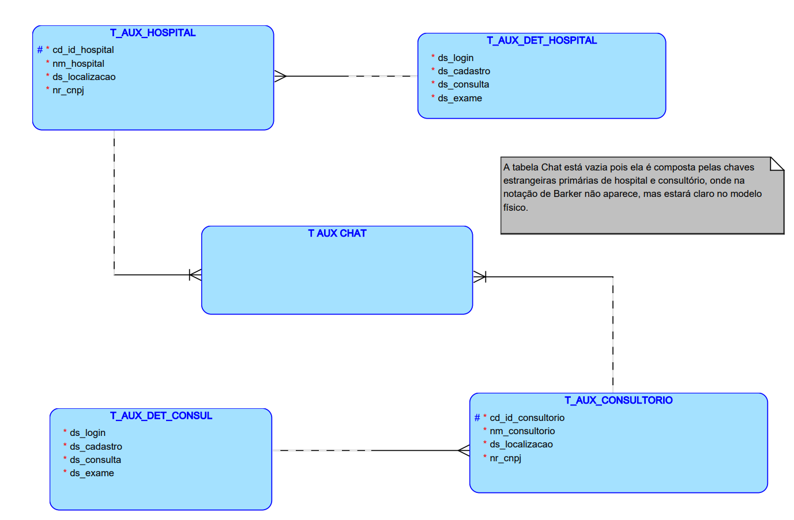
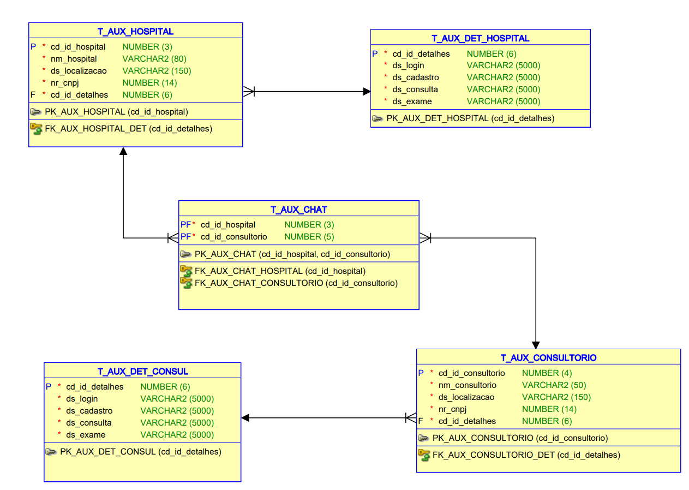
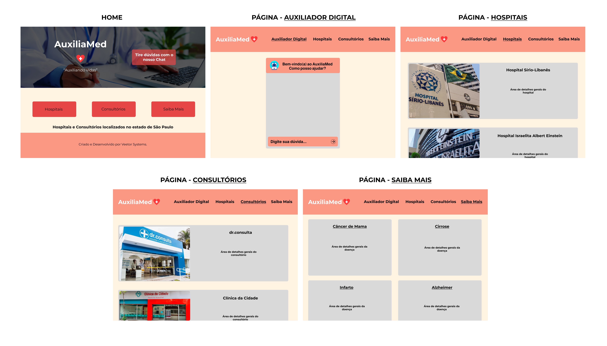
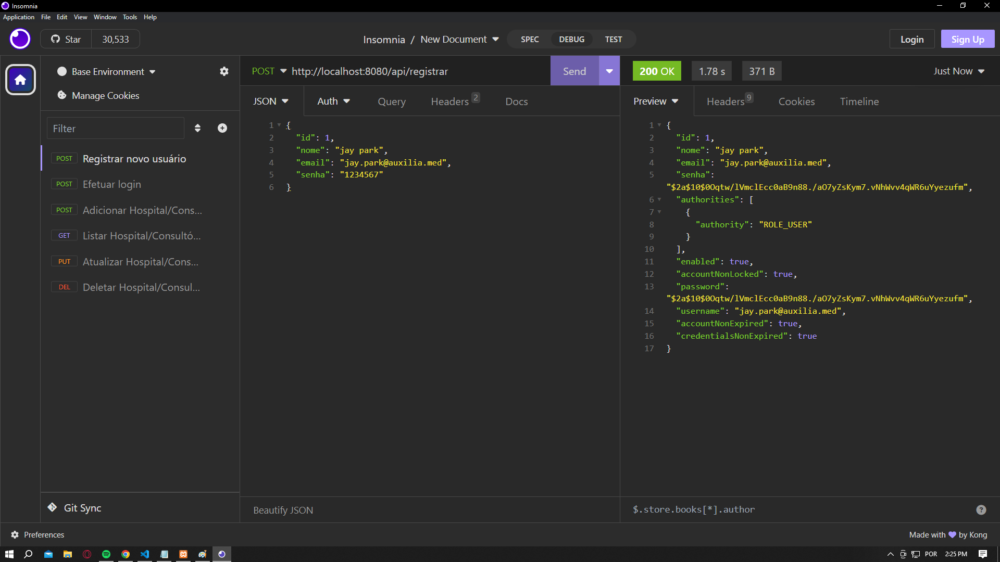
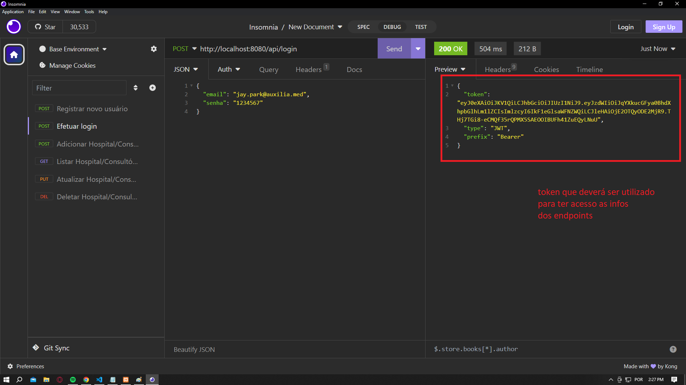
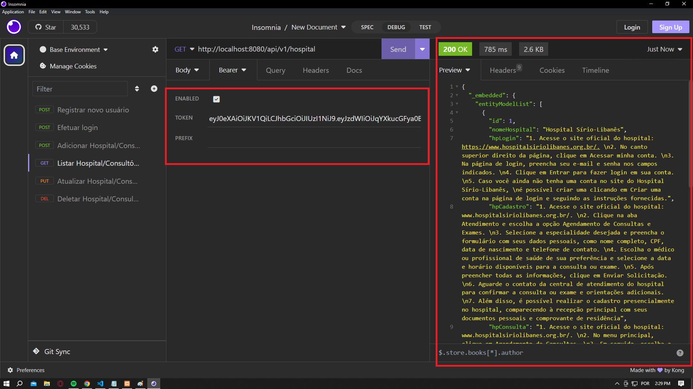
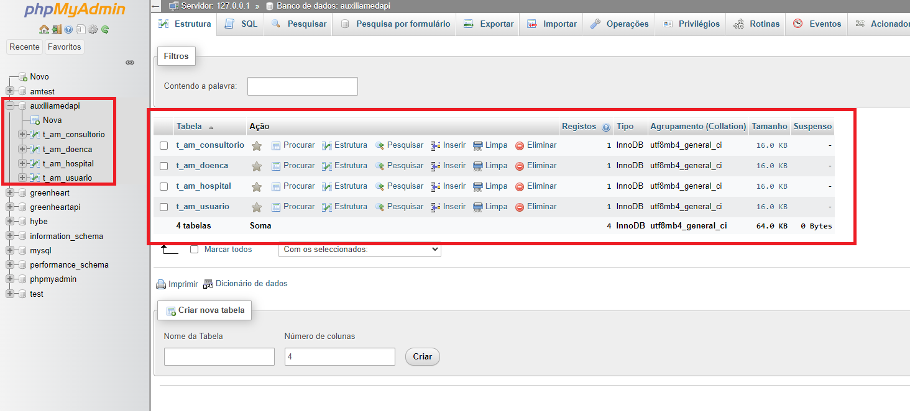
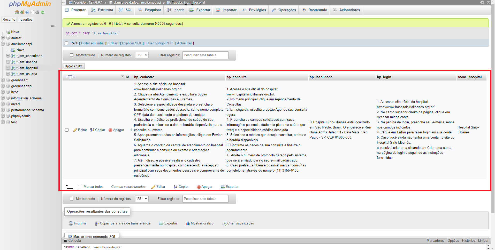

# AuxiliaMed

App e plataforma web voltados ao auxílio de pessoas idosas, com o objetivo de facilitar o acesso por parte dessas pessoas aos recursos dos meios digitais de saúde.

#### Grupo: Veetor Systems
##### Integrantes:
##### RM95315 - Bruno Eduardo Caputo Paulino
##### RM95122 - Felipe da Silva Galvão
##### RM93960 - Isabella Piola Fernandes -> **2TDSR**
##### RM95145 - Isabella Tiemy Hatamiya Silva
##### RM94222 - Lethycia Moraes Maia

---

## Objetivo e escopo do projeto:
### Tema escolhido
Otimização do acesso por meios digitais á informações médicas de modo eficaz, menos burocrático e de maneira confiável, pensando especialmente nos problemas que as pessoas da terceira idade enfrentam.

### Descrição do problema
Quando se pensa em questões relacionadas a área de saúde envolvendo os meios digitais e a infraestrutura de T.I, é notável que ainda existem diversos problemas a serem solucionados relacionados ao acesso a informações médicas de modo confiável, rápido, menos burocrático e eficaz. Com base em análises, percebemos que uma grande quantidade de pessoas, especialmente as de idade avançada, apresentam dificuldades de navegação na utilização dos meios digitais de saúde, pois é nesta fase que segundo a pedagoga e mestre em Tecnologias da Inteligência e Design Digital pela Pontifícia Universidade Católica de São Paulo (PUC-SP) Kely Cristina Pereira Vieira: “Está é uma fase da vida que muitas delas começam a apresentar dificuldade em memorizar o passo a passo para acessar os softwares e aplicativos, por isso precisam de uma sequência bem determinada para aprender”, com isso, pensando especialmente na área de saúde, muitas delas por exemplo, enfrentam dificuldades na hora de navegar e utilizar os meios digitais de hospitais e consultórios que frequentam. Em vista deste problema, pensamos em uma solução para ajudar a amenizar este cenário.

### Solução encontrada e funcionalidades
Com base em discussões e reuniões de ideias, encontramos um meio de solucionar o problema através da criação de um App e plataforma web de saúde simplificados, que haverá como principal ferramenta, um auxiliador digital que funcionária como um ChatBot, capaz de capitar dúvidas comuns de usuários e devolver respostas com a ajuda do ChatGPT. Quando o usuário acessar a plataforma (ou o app), ele irá se deparar com o auxiliador, que ao ser perguntado dúvidas como: “Como faço para marcar uma consulta?”, “Como faço para achar um exame?” ele retornará ao usuário as respostas para essas dúvidas de forma exemplificada. O objetivo também, é a criação de páginas que contenham informações sobre hospitais e consultórios localizados no estado de São Paulo. Além disso, informações sobre doenças, formas de previni-lás, assuntos sobre bem-estar e saúde, 

(Nós pretendemos utilizar os conceitos de IA e IoT na parte de Pré-triagem do nosso projeto, onde nela, nós não queremos que auxiliador digital Chatbot apenas capte sintomas e mostre o diagnóstico para possíveis doenças, e sim, nós queremos nos aprofundar em dar resultados mais detalhados, treinando uma IA com “datasets” de algumas doenças e pedindo ao usuário que insira dados mais complexos como por exemplo os dados de um exame de sangue, para que assim, nossa IA possa testar, estudar e devolver respostas precisas com números, comparações, descrições e alertas para casos que envolvam grande proximidade com a chance de o usuário ter tal doença ou talvez uma suspeita, sempre com o objetivo de aconselha-lo a se encaminhar para um profissional de saúde especializado, porém, estamos achando métodos de fazer isto possível até o produto final da challange para a 4° entrega.)

---
### Arquitetura da solução (Diagrama de classes, DER/MER, Fluxograma)


**(note que neste diagrama de classes não são representandos o auxiliador digital e a parte de pré-triagem, pois são funcionalidades que não precisam de modelagem e nem de API)**




---
### Protótipo funcional da aplicação (Web)



---
### Procedimento para instalação e execução da API
A api foi desenvolvida utilizando o framework Spring Boot do Java, portanto inicialmente, para a sua execução, é necessário baixar as extensões do Spring Tools no Visual Studio Code. 

Para testes dos endpoints da aplicação e a realização do **"CRUD"**, foi utilizado o software **"Insomnia"**.

Está API possui sistema de **Security e JWT** para a proteção de seus dados, portanto, para ser executada, os seguintes passos devem ser seguidos:

- Após rodar a aplicação no VsCode, o usuário deverá abrir o "Insomnia", selecionar um novo "HTTP Request" de tipo "POST", colar no body o JSON para registro e clicar em "Send:

`POST` http://localhost:8080/api/registrar

```js
{
	"id": 1,
	"nome": "jay park",
	"email": "jay.park@auxilia.med",
	"senha": "1234567"
}
```


**Quando executado, um status "200 OK" aparecerá no canto direto informando que as informações foram adicionadas no banco de dados.**


- Depois do usuário se registrar, ele deverá selecionar um novo "HTTP Request" de tipo "POST", colar no body o JSON de login, inserir o "email" e "senha" cadastrados para que  assim, seja possível ter acesso aos endpoints:

`POST` http://localhost:8080/api/login

```js
{
	"email": "jay.park@auxilia.med",
	"senha": "1234567"
}
```

**Um token será retornado após o login, onde com ele, será possível acessar as informações dos endpoints.**

- O usuário deverá selecionar um novo "HTTP Request" com a URL necessária para listar, adicionar, apagar e atualizar os dados, e para ser autenticado e ter acesso aos dados, na aba "Auth" localizada abaixo da URL, deverá selecionar a opção "Bearer Token" e colar o token recebido no Login. Após clicar em "Send", os dados serão retornados:

`GET` http://localhost:8080/api/v1/hospital


Para persistência de dados, foi utilizado o **"XAMPP"** (software de distribuição do Apache contendo PHP, MySQL e Perl) e o banco de dados **"phpMyAdmin"**. Uma vez que a API está sendo desenvolvida em uma única máquina de um dos integrantes do grupo com o usuário "root" e armazenando os dados, outros usuários em máquinas diferentes não conseguem ter o acesso aos dados (Hospitais, Consultórios e Doenças) do AuxiliaMed (mas conseguem fazer um CRUD para testar a api). Se outro usuário quiser testar a api em sua máquina, primeiramente, é previamente necessário criar um banco de dados no phpMyAdmin com o nome "auxiliamedapi" antes de rodar a api.

#### Tabelas no banco de dados (phpMyAdmin):


#### Exemplo: Tabela Hospital



